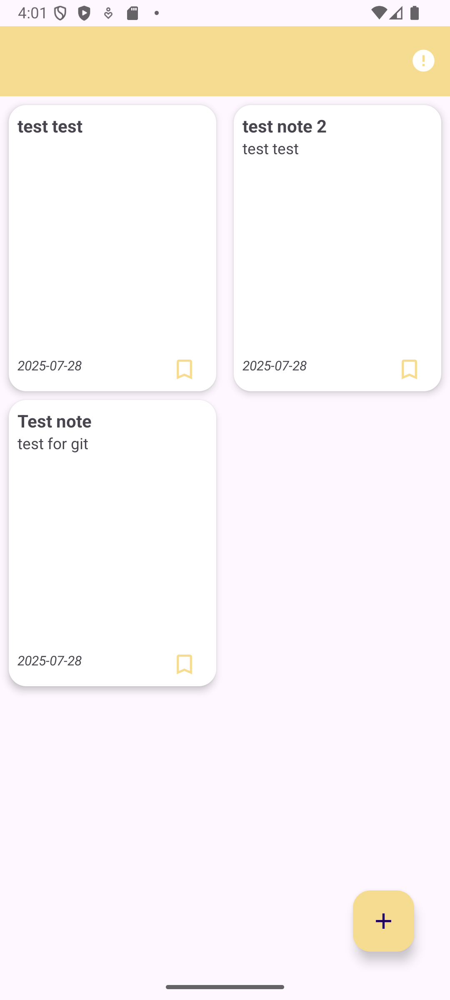
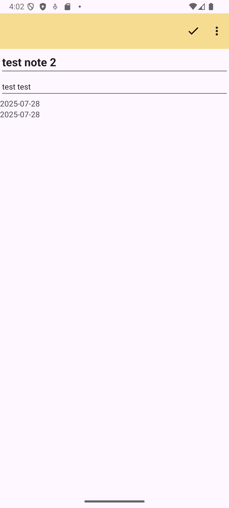
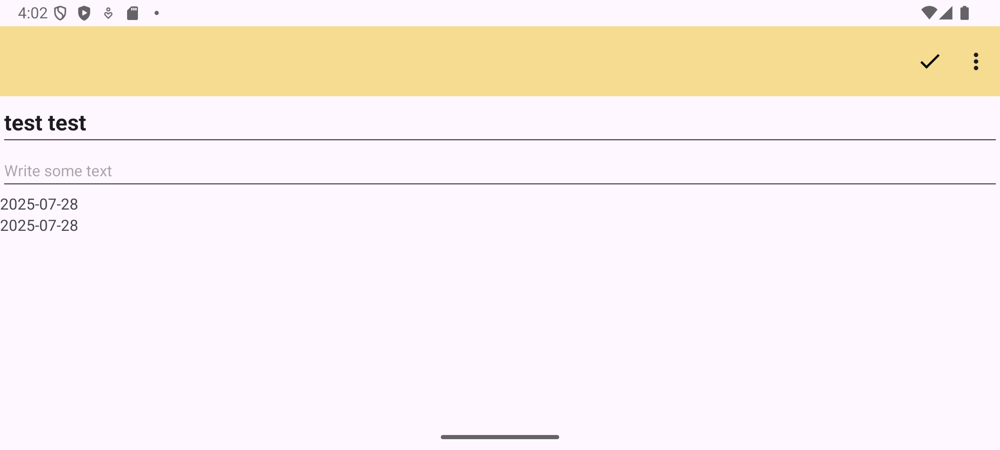
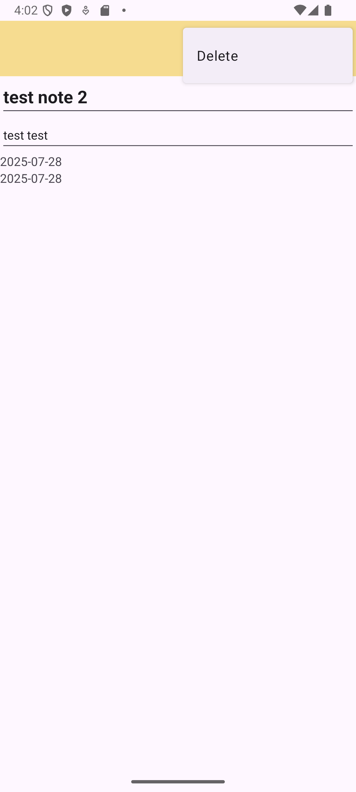

# 📱 Note's List 

Приложение разработано в рамках первой недели Android-интенсива. В этом приложении я повторял принцип работы ViewModel.

## 🛠 Технологии и подходы

- **MVVM**: Для управления состоянием UI
- **Локальная БД**: CRUD операции на Room
- **UI**: XML-разметка, фрагменты
- **RecyclerView**: Оптимизация через DiffUtil
- **Навигация**: FragmentManager

| Главный экран | Создание/редактирование | Сохранение состояния |
|---------------|-------------------------|----------------------|
|  |  |  |
| Список заметок с избранным | Интерактивный редактор | **Текст сохраняется при смене ориентации** |

| Удаление |
|----------|
|  |
| Удаление через Toolbar |

